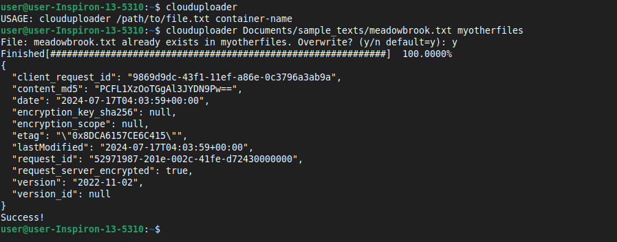

# CloudUploaderCLI

A CLI tool that can upload files to Azure Storage Accounts. Built using bash and Azure's CLI. 



## Setup

1. Must have Azure CLI installed. https://learn.microsoft.com/en-us/cli/azure/install-azure-cli
2. Configure the .env file at the root of this project with the following values: 
    ```
    SUBSCRIPTION_ID= 
    ACCOUNT_NAME=
    AZURE_STORAGE_KEY=
    ```
3. Ensure that ~/bin is a part of $PATH by running: `echo $PATH`
4. Run `installer.sh` 
    - **NOTE: .env values will be copied to ~/bin/.clouduploaderconfig**
    - Alternatively, you can run `clouduploader.sh` locally from the project directory. Ensure propery permissions with `sudo chmod +x clouduploader.sh`
5. Now ready to run the command `clouduploader` on the CLI!